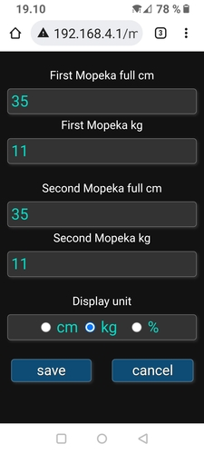

## About Mopeka✓ gas tank sensors and OH2MP Smart RV

[Mopeka✓ sensors](https://www.mopeka.com/product-category/sensor/) are a family of gas tank level sensors 
that are mounted in the bottom of gas tanks. They use ultrasound on measuring the distance from bottom to 
the surface of the liquified gas in the container. The exact amount of gas depends mostly on geometry of 
the container but also gas composition and temperature affect a little.

The default values are suitable with 11kg propane bottles which are used at least Nordic and Baltic 
countries. When such bottle is full, Mopeka sensor says there is about 35 centimeters of gas. The arc 
geometry on the bottom of the bottle, speed of sound in different gas mixtures and temperature are simply 
ignored here. The readings we get are good enough.

### Configuring Mopeka sensors

1. Add them from the portal's sensors config just like another tags.
2. Go to Mopeka config and add right values. If you have only one Mopeka gas sensor, set the value to
_both_ first and second sensor slots. See image.

If you don't know the right value for centimeters for full container, check a full container with
Mopeka's official mobile app. Round that value to integer like 35 on the example image.

You can choose the unit here which is used on the display. Centimeters, kilograms or per cent.

