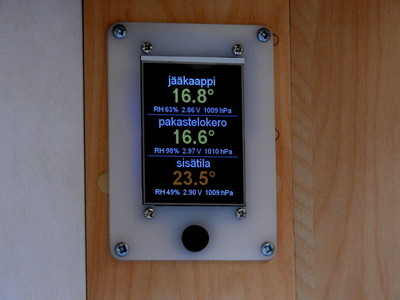
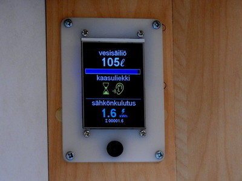
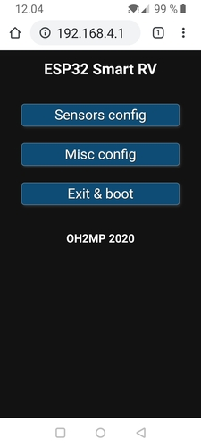
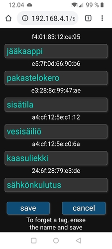
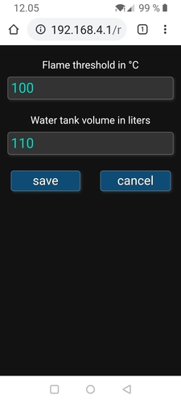

# OH2MP ESP32 Smart RV

### An ESP32 based smart screen for a motorhome or caravan

This project is for to make a "central screen" for a motorhome or caravan. The software listens to
several BLE beacons and shows their data on a TFT display. The architecture is very modular. Several
different BLE beacons are supported now and more are to come. If you don't have all of those beacons, you can 
just ignore the support. The software shows data only from known beacons that are configured from the
web portal (see later).

The temperatures, pressure, humidity etc. use [Ruuvi tags](https://ruuvi.com/). Ruuvi tag is an excellent
product and with them there's no need of inventing the wheel again. Only data format V5 (RAWv2) is supported.
See Ruuvi documentation for setting the right mode.

Other beacons that are supported are:

- [ESP32 Water sensor](https://github.com/oh2mp/esp32_watersensor)
- [ESP32 Energy meter](https://github.com/oh2mp/esp32_energymeter)
- [ESP32 MAX6675 beacon for thermocouples for gas fridge](https://github.com/oh2mp/esp32_max6675_beacon)

Don't worry about that the sensor names in these example photos are in Finnish. They are fully configurable via
portal mode that is in English.




The file `smart_rv_for_laser_cutter.svg` included in this repository is for laser cutters if you want to 
make a similar plexiglas frame and have a cutter available.

The display used here is ILI9341 driven 320x240 TFT. It can be bought eg. from 
[Banggood](https://www.banggood.com/2_8-Inch-ILI9341-240x320-SPI-TFT-LCD-Display-Touch-Panel-SPI-Serial-Port-Module-p-1206782.html?p=6H24052869562201510Z)
and the price is less than 10€.

------

## Code configuration, wiring and dependencies

The screen graphics use [Bodmer's TFT_eSPI library](https://github.com/Bodmer/TFT_eSPI).

The library needs to be configured for the right driver chip etc. and with this project it's enough
to change file `libraries/TFT_eSPI/User_Setup.h` lines 188-193 as follows:

```c
// #define TFT_MISO 19
#define TFT_MOSI 23
#define TFT_SCLK 18
#define TFT_CS   15  // Chip select control pin
#define TFT_DC    4  // Data Command control pin
#define TFT_RST   2  // Reset pin (could connect to RST pin)
```

It's very recommended to use exactly these pins for the display even though they are configurable. 
They have been tested and work well. The MISO pin is not connected because we are not reading anything
from the display driver chip in this project.

In the main program code there are defines for push button and backlight LED. 
Connect a button between the pin and ground and connect the LED pin to the display's BL pin.
Short press increases the lightness of the screen and long press switches the unit to the portal mode.

```c
#define BUTTON 12                // push button for lightness and long press starts portal
#define BLLED 19                 // backlight led
```

You must also use the [Arduino ESP32 filesystem uploader](https://github.com/me-no-dev/arduino-esp32fs-plugin/)
to upload the files in the data directory. There are the html and css files needed for portal.

------

## Portal mode

If the button is pressed over 5 seconds, the unit switches to the portal mode.

In the start of portal mode the ESP32 is listening 10 seconds for new beacons.
WiFi AP is not listening yet at that period and a listening symbol is visible on the screen. After you see
the AP info on the screen, connect to WiFi **ESP32 Smart RV**, accept that there's no internet connection
and take your browser to !http://192.168.4.1/

The web GUI should be self explanatory. Flame threshold is for MAX6675 beacon and it's the temperature 
that we believe that the gas flame is burning. 100°C is a good value to start. It looks that when the 
flame distinguishes, the temperature drops under 100 quite fastly depending on the distance of the 
thermocouple. The water tank volume is for that the horizontal scale can be drawn onto the screen under 
the water tank info.

It's a good idea to find out the Bluetooth MAC addresses of the beacons beforehand. For Ruuvi tags the
easiest way is to use Ruuvi software. For other beacons eg. 
[BLE Scanner by Bluepixel Technologies](https://play.google.com/store/apps/details?id=com.macdom.ble.blescanner)
is a suitable app for Android.

There's almost no sanity checks for the data sent from the forms. This is not a public web service and if 
you want to mess up your board or try to make a denial of service using eg. buffer overflows, feel free to 
do so.

### Sample screenshots





------

## Configuration option

The portal saves all configurations onto the SPIFFS filesystem. They are just text files, so you can 
precreate them and then you don't have to use the portal at all. Just place your configuration files into 
the data directory along the html files and upload them with ESP filesystem uploader. Only two files are 
used and their formats are:

### known_tags.txt

One known tag per row. First the MAC address in lowercase hex and colons between bytes, then TAB, 
then name of the tag and newline (ascii 0x0A).

**Example known_tags.txt file:**

```
f4:01:83:12:ce:95	foo
e3:28:8c:99:47:ae	bar
```

### misc.txt

Only two rows: First row contains the flame threshold and the second row the tank volume. Lines ended by newline.

**Example misc.txt file:**

```
100
110
```

------

## Fonts

There are several fonts used with the display. They are as const arrays in `tftfonts.h`. If you want to 
customize them, then look at the [fonts subdirectory}(fonts/) of this repository. Otherwise you can just 
ignore or even delete the contents of that directory. They are needed only if you want to change the 
fonts.

------
