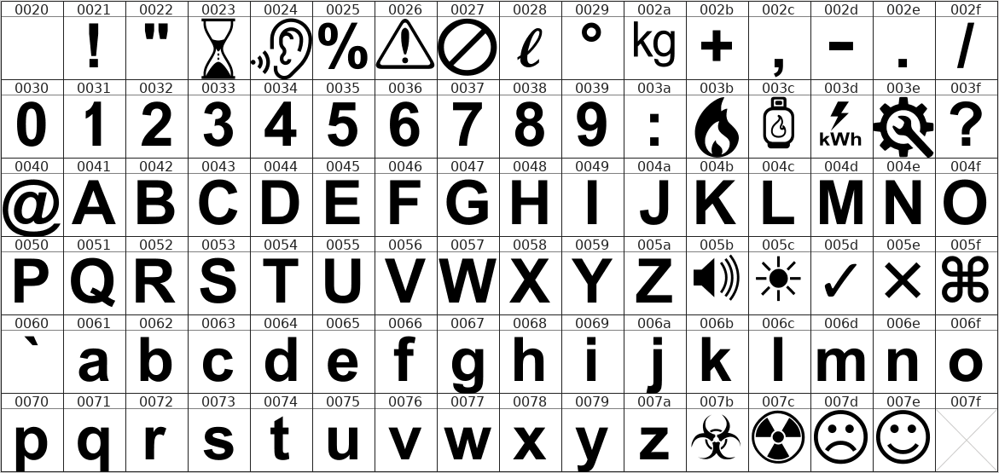

# Fonts used with OH2MP ESP32 Smart RV display

Here are files for creating the fonts. If you don't want to customise them and are ok with the fonts
provided, you can ignore the contents of this directory.

See the Tools provided with the TFT_eSPI library and read the documentation how to create the fonts with 
Processing tool. You also will probably need FontForge.

The big font is based on Arial Bold and contains several symbols. The sfd file for FontForge is also included.

There is a shell script included which creates the full `tftfonts.h` file.

------

Character map of the Bigfont:

